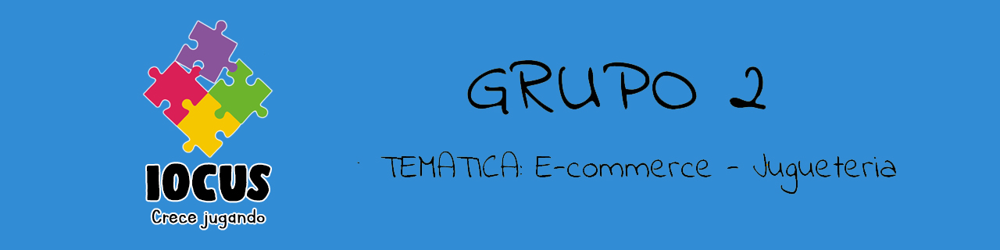

# **Grupo 2** - tematica: Ecommerce de Jugueteria :star2:
---
## **E-Commerce: IOCUS** :guardsman::dizzy:

-Nuestro Sitio ofrecera todo tipo de juguetes tanto para niños como para coleccionistas.Principalmente Figuras de accion , vehiculos ,Disfrases , juegos de mesa en donde trabajaremos con marcas como Disney, Mattel, Playmates,Hasbro, Lego, entre otras.

<dl>
  <dt>¿Quién será nuestra audiencia objetivo?</dt>
  <dd>Nuestra audiencia  objetivo son principalmente los niños cuyo juguetes son fundamentales en el desarrollo y por otra parte los padres tienen un rol imprescindible en la elección y adquisición de estos productos, por ultimo tambien ayudamos a los coleccionistas a completar su coleccion.</dd>

<dl>
  <dt>¿Cómo ajustaremos nuestra oferta a ese público?</dt>
<dd>Ajustaremos la oferta a traves de encuestas y conocimiento de lo más requerido en el mercado actual.<dd>

## Integrantes del equipo
* **Maria Eugenia Amaya:**
 

* **Gabriel Carrizo:**
 

* **Fernando Ojeda:** Tengo 32 años y soy estoy estudiando para ser un desarrollador web Full-Stack. En la programación encontré mi pasión y estoy decidido a seguir este camino hasta ser un profesional propiamente dicho. Suelo leer mucho, sobre todo libros o novelas visuales de horror o suspenso. 

* **Damian Trajster:** Tengo 35 años. Soy Programador y Coleccionista, Actualmente curso Desarrollador web Full-Stack en Formar/Digital House,quiero dar un giro a mi carrera profesional con este curso :) so let's Go!

## Referentes del mercado

Para llevar a cabo este proyecto, tomamos como páginas referentes a las mas grandes y conocidas del momento:

 * [Cebra](https://cebra.com.ar/)
 * [El Mundo Del Juguete](https://www.elmundodeljuguete.com.ar/)
 * [Hasbro](https://products.hasbro.com/es-lam)
 * [Jugueteria Bambi](https://www.jugueteriabambi.com.ar/)
 * [Fisher Price](https://www.fisher-price.com/es-es)
 * [Ondule](https://ondule.com.ar)
